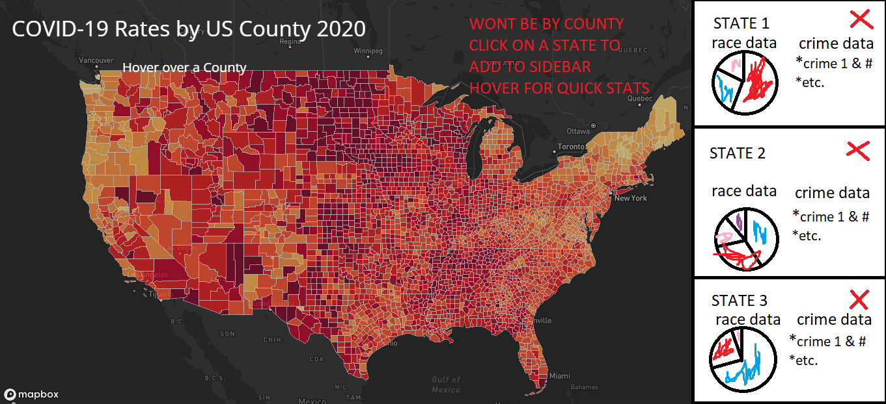

# HateCrimeWebMap
## Group AB3
### Samuel Affolder, Draco Bynum, Liam Geary, Luke Houser, Adam Nicewarner
---
## About
Our project is to make a choropleth web map covering the United States which shows differences in hate crime statistics, grouped by states; as well as providing information on the demographics of each state. We’ll be getting hate crime statistics from the Uniform Crime Report and population data that includes race from the US Census. There are two goals for this map: first, it should show to the general populace the scope at which hate crimes occur; second, it should allow the reader to make their own informed decision on if they think there is any correlation between a state’s demographics and their respective number and type of hate crimes.
## Impact

Ideally, the impact of this project will be a more informed population about where and what hate crimes happen most often and what that state's demographics look like. However, there are ways this project could cause unintended harm. One way this could happen is the viewer making assumptions about what we are trying to imply as mappers of both kinds of this information at once.  It could be that by including demographic information as well as hate crime information it is implying that we are saying the majority group is responsible for the crimes against the minority, or the inverse.  When looking at larger data and not individual cases it cannot be stereotyped that such correlations are definitive.  Another impact is that the viewer could see our map and decide that hate crimes are not as ‘bad’ or immediately pressing as they once thought.  Since the map will be using states as the areal units, the map may misrepresent the data to political advocate types. Say, for instance, there’s an extremely high rate of racial hate crimes in one particular county or city, but the rest of the state has very few. The map may then under-represent that local area, since it would look as though that state as a whole has few hate crimes. Problems with data can be mitigated through the use of careful data cleaning, but the areal units problem is much harder to solve. The Uniform Crime Report often lacks data on where exactly the crime occurred, only what state it occurred in.
## Project Specs

Our project format will be a generic digital geographies project, with a smart dashboard. Specifications for the map include a mercator projected dark theme basemap centered on the United States with default zoom options since we will be using vector instead of raster data.  For the thematic layer we will have a choropleth map of the hate crimes by state count from the FBI.  And when a viewer hovers over the state boundary they will get an at a glance view of the statistics of how many hate crimes happened in that state in 2019.  When a viewer clicks on a state it will use javascript to add a pie chart based on demographics of that state to the smart dashboard along with the detailed breakdown of the top hate crime statistics for that state in 2019.  The information for each state will be presented side by side and each state added to the dashboard, up to 5, will be vertically aligned.  The data for the state demographics comes from the US Census.
## Data Sources
- [US Census Data](https://data.census.gov/cedsci/table?q=demographic&g=0100000US%240400000&tid=ACSDP1Y2019.DP05)
- [State Data](https://ucr.fbi.gov/hate-crime/2019/topic-pages/tables/table-13.xls/view)
- [National Data](https://ucr.fbi.gov/hate-crime/2019/topic-pages/tables/table-12.xls)